# Quantization in Practice | Hands-on AI Homework 3
**Φοιτητής:** Μάρκος Συρούκης  
**A.M.:** 09325023  
**Εξάμηνο:** 2ο  
**Μάθημα:** Hands-on AI Homework 3  
**Σχολή:** ΣΕΜΦΕ, ΕΜΠ  

---

Εφαρμογή των αλγορίθμων quantization (που υλοποιήθηκαν στο lab) σε
ένα πραγματικό γλωσσικό μοντέλο, με τις βιβλιοθήκες παραγωγής **bitsandbytes**,
**AutoGPTQ** και **hqq**. Συγκρίνουμε επίπεδα ακρίβειας (FP32 → INT2),
αξιολογούμε το GPTQ έναντι naive rounding, μελετάμε την ευαισθησία στα δεδομένα
calibration, και καταλήγουμε σε τεκμηριωμένες προτάσεις deployment.

> **Σημείωση:** ο κώδικας του lab (NumPy) **δεν** χρησιμοποιείται εδώ αλλά οι
> βιβλιοθήκες υλοποιούν τους ίδιους αλγορίθμους σε κλίμακα με hardware-optimised
> kernels.

---

## 1. Μοντέλο & Hardware

- **Μοντέλο:** `Qwen/Qwen2.5-0.5B` _(ίδιο σε όλα τα tasks και ορίζεται στο `src/common.py:MODEL_NAME`)_
- **Hardware (δύο μηχανήματα — βλ. §2):**
  - _Dev box:_ NVIDIA **GTX 1660 6 GB**, Turing **sm_75 (χωρίς tensor cores)**, **16 GB DDR4-3200 system RAM**, Python 3.11, torch 2.12.1+cu130.
  - _Final benchmarks:_ rented **vast.ai · RTX 4090 24 GB**, Ada **sm_89** (~81.4 TFLOPS, ~872.8 GB/s), **32 GB high-speed system RAM**, CUDA 13.1, torch 2.12.0+cu130, Python 3.12, CPU AMD EPYC 7B13, image *PyTorch (Vast)*, ~$0.375/hr.
- **Evaluation corpus:** WikiText-2 test split, πρώτα 256 tokens κάθε εγγράφου,
  **σταθερό** σε όλα τα Tasks 1–3 (`src/common.load_eval_corpus`).

---

## 2. Hardware journey και γιατί χρειάστηκε rented GPU

Τα πειράματα **ξεκίνησαν στη GTX 1660**. Το αρχικό Task 1 εκεί:

| Precision | Size (MB) | Tokens/sec | Perplexity |
|-----------|-----------|------------|------------|
| FP32 | 1884.6 | 37.1 | 22.733 |
| BF16 | 942.3 | 33.5 | 22.657 |
| **INT8** | — | — | **δεν τρέχει** |
| INT4 | 430.4 | 24.1 | 27.504 |

Δύο **τοίχοι** σταμάτησαν το πείραμα στο δικό μου hardware (η σειρά GTX 16xx είναι Turing **χωρίς tensor cores**):

1. **INT8 αδύνατο** — το bitsandbytes `LLM.int8()` απαιτεί `cublasLt` INT8 matmul → `CUBLAS_STATUS_NOT_SUPPORTED`. Ως αποτέλεσμα η γραμμή INT8 έμενε κενή.
2. **GPTQ μη-αντιπροσωπευτικό throughput**: το optimized Marlin kernel θέλει Ampere (sm_80+)· έπεφτε σε αργό `BACKEND.TORCH` (GPTQ 11.4 tok/s, *πιο αργό* από το NF4). Επίσης BF16 ήταν πιο αργό από FP32 (χωρίς tensor cores).

**Λύση:** νοίκιασα **RTX 4090** (Ada sm_89) στο vast.ai (~$0.375/hr). Ουσιαστικά για όλη την εργασία το κόστος δεν ξεπέρασε το κόστος ενός καφέ, επομένως πιστεύω άξιζε το πείραμα. Εκεί η INT8 τρέχει, το Marlin GPTQ kernel ενεργοποιείται (`GPTQ_BACKEND=auto`), και η σχέση χαμηλότερης ακρίβειας με ταχύτητα εμφανίζεται σωστά. **Όλοι οι πίνακες στα §8–§15 είναι από την RTX 4090.**

---

## 3. Δομή Project

```
.
├── pyproject.toml              # uv project + dependencies
├── requirements.txt            # human-readable direct deps
├── requirements.lock.txt       # ΑΚΡΙΒΕΙΣ pinned εκδόσεις (reproducible install)
├── Dockerfile / .dockerignore  # reproducible GPU image (CUDA devel base)
├── setup_vast.sh               # vast.ai GPU setup (στήνει το stack χωρίς torch)
├── run_all.py                  # ΕΝΙΑΙΟ entry point: --tasks {1,2,3,bonus,ablation,all}
├── src/
│   └── common.py               # FIXED eval corpus, perplexity, μετρήσεις
├── task1_benchmark.py          # Task 1 — precision sweep (FP32/BF16/INT8/INT4)
├── task2_gptq.py               # Task 2 — GPTQ vs naive INT4
├── task3_calibration.py        # Task 3 — calibration domain sensitivity
├── bonus_2bit_hqq.py           # Bonus A — 2-bit HQQ + precision curve
├── ablation_gptq.py            # Extra — GPTQ group_size / n_calib ablation
├── cpu_benchmark.py            # Extra — CPU-only benchmark (Σενάριο 1 validation)
├── report.md                   # Task 4 — deployment recommendations (≥500 λέξεις)
├── collaboration_report.md     # Bonus B — joint report (προαιρετικό)
└── results/                    # όλα τα PNG deliverables
```

> Τα quantized weights **δεν** commit-άρονται (μεγάλα + αναπαραγώγιμα — βλ.
> `.gitignore`). Τα GPTQ μοντέλα cache-άρονται τοπικά για επαναχρησιμοποίηση.

---

## 4. Εγκατάσταση

**Λήψη κώδικα:**

```bash
git clone https://github.com/MarkosSi34/hands-on-ai-hw3.git
cd hands-on-ai-hw3
```

Στη συνέχεια, δύο ισοδύναμοι τρόποι — και οι δύο στήνουν ένα `.venv` με τις ίδιες
εξαρτήσεις (`pyproject.toml` και `requirements.txt` περιέχουν το **ίδιο** σύνολο πακέτων).

**Επιλογή A: uv (προτεινόμενο):**

```bash
uv python list                 # δες ποιες Python είναι διαθέσιμες
uv python install 3.12         # (αν λείπει) κατέβασε την 3.12
uv venv --python 3.12          # φτιάξε το .venv με αυτήν
uv sync                        # εγκατέστησε τις εξαρτήσεις στο .venv
source .venv/bin/activate
```

**Επιλογή B: κλασικό pip:**

```bash
python3 -m venv .venv
source .venv/bin/activate
pip install -r requirements.txt
```

> **Ακριβές CUDA-matched torch:** και οι δύο τρόποι τραβούν το torch από το
> default PyPI. Για να αναπαράγεις **ακριβώς** το build της RTX 4090
> (torch 2.12.1+cu130) χρησιμοποίησε το `requirements.lock.txt` ή το Docker image
> (βλ. §6), όπου το torch εγκαθίσταται πρώτο από το `cu130` wheel index.

---

## 5. Εκτέλεση: μία εντολή ανά task

```bash
python3 task1_benchmark.py      # → results/task1_benchmarks.png + πίνακας
python3 task2_gptq.py           # → results/task2_weight_distributions.png, task2_gptq_comparison.png
python3 task3_calibration.py    # → results/task3_calibration_study.png
python3 bonus_2bit_hqq.py       # → results/bonus_2bit_precision_curve.png (Bonus A)
CUDA_VISIBLE_DEVICES="" python3 cpu_benchmark.py   # → results/cpu_benchmark.png (CPU/Σενάριο 1)
```

…ή όλα μαζί με ένα entry point:

```bash
python3 run_all.py --tasks all                       # 1,2,3,bonus,ablation
python3 run_all.py --tasks 1 2 3                      # υποσύνολο
GPTQ_BACKEND=auto python3 run_all.py --tasks 2 3      # γρήγορο Marlin kernel σε Ampere+
python3 run_all.py --tasks 1 2 --model Qwen/Qwen2.5-1.5B   # scaling extension
```

> **`GPTQ_BACKEND`**: default `TORCH` (pure-PyTorch, τρέχει σε κάθε GPU incl. GTX 1660).
> Σε Ampere+ (sm_80+) προτιμήστε `auto` για το βελτιστοποιημένο Marlin GPTQ kernel.

---

## 6. GPU session & αναπαραγωγιμότητα

Δύο σημεία απαιτούν GPU με **tensor cores** (που η GTX 1660 δεν έχει), τα αφήνουμε
ως ρητά documented κενά (βλ. §7) και τα γεμίζει ένα Ampere+ box:

- **INT8 (Task 1)**: bitsandbytes `LLM.int8()` τρέχει μόνο εκεί.
- **Πραγματικό GPTQ throughput**: με `GPTQ_BACKEND=auto` το Marlin kernel δίνει
  τα σωστά (χαμηλή ακρίβεια = ταχύτερη), σε αντίθεση με το τοπικό Torch fallback.

**Reproducible image** (μοντέλα κατεβαίνουν στο runtime, δεν ψήνονται στο image):

```bash
docker build -t hw3-quant .
docker run --gpus all -e GPTQ_BACKEND=auto \
  -v $HOME/.cache/huggingface:/root/.cache/huggingface \
  -v $(pwd)/results:/app/results \
  hw3-quant --tasks all
```

Το CUDA *devel* base φέρνει `nvcc`, οπότε το Marlin kernel κάνει JIT-compile
(λύνει το `CUDA_HOME` πρόβλημα του dev box). Καρφωμένες εκδόσεις: `requirements.lock.txt`.

---

## 7. Σημειώσεις περιβάλλοντος & αλλαγές υλοποίησης

> Καταγράφονται οι αποκλίσεις από το αρχικό scaffold που χρειάστηκαν για να
> τρέξει ο κώδικας στο πραγματικό περιβάλλον (Python 3.11, `transformers` 5.x,
> `torch` 2.12 + CUDA 13, GPU **NVIDIA GTX 1660 / 6 GB**).

1. **`wikitext` → `Salesforce/wikitext`** (`src/common.py`, `task2_gptq.py`).
   Το παλιό `wikitext` repo-id φορτώνει legacy *loading script* (`wikitext.py`)
   που η νέα `datasets` δεν υποστηρίζει (σφάλμα `Invalid HF URI`). Το canonical
   parquet mirror `Salesforce/wikitext` φορτώνει χωρίς script. Ίδια δεδομένα.

1b. **Task 3 datasets → parquet ισοδύναμα** (`task3_calibration.py`). Τα
   `codeparrot/github-code` (Python) και `pg19` (academic) είναι script-based
   (`RuntimeError: Dataset scripts are no longer supported`). Αντικαταστάθηκαν:
   Python → `google-research-datasets/mbpp` (eval = **test** split, calibration
   C2 = **train** split, ώστε να μην επικαλύπτονται)· academic C3 →
   `CShorten/ML-ArXiv-Papers` (abstracts). Το `wikimedia/wikipedia` (C1) είναι
   ήδη parquet και άρα έμεινε ως έχει.

2. **`auto-gptq` → `gptqmodel`** (`task2_gptq.py`, `task3_calibration.py`,
   `pyproject.toml`, `requirements.txt`). Το `auto-gptq` είναι εγκαταλελειμμένο
   και **δεν κάνει import με `transformers` 5.x** (ψάχνει το αφαιρεμένο σύμβολο
   `no_init_weights`). Το `gptqmodel` είναι ο συντηρούμενος διάδοχος με
   ισοδύναμο GPTQ· νέο API: `GPTQModel.load(...)` / `model.quantize(calib,
   tokenizer=...)` / `model.save(...)`. Η calibration περνά πλέον ως λίστα
   **strings** (το tokenization γίνεται εσωτερικά). Παρ-εξάρτηση: `torchvision`
   (το `gptqmodel` το κάνει import eagerly κατά τη φόρτωση).
   - **Inference kernel επιλέξιμο με env `GPTQ_BACKEND`** (default `TORCH`). Το
     Marlin kernel απαιτεί Ampere (sm_80+) + `CUDA_HOME`/`nvcc`· στη GTX 1660
     (sm_75) αποτυγχάνει, οπότε το `TORCH` (pure-PyTorch) τρέχει παντού. Στην
     RTX 4090 βάζουμε `GPTQ_BACKEND=auto` → ενεργοποιείται **Marlin** (πραγματικό
     throughput, βλ. §10). Η quantization πετυχαίνει ανεξαρτήτως kernel.

3. **INT8 (bitsandbytes): skip στη GTX 1660, μετρήθηκε στην RTX 4090.** Το
   `LLM.int8()` απαιτεί `cublasLt` INT8 matmul που η GTX 16xx (sm_75) δεν
   υποστηρίζει → `CUBLAS_STATUS_NOT_SUPPORTED`. Το Task 1 κάνει gracefully skip ενώ
   στην RTX 4090 η γραμμή INT8 συμπληρώνεται κανονικά (§8).

4. **HQQ μέσω native API, όχι `HqqConfig`** (`bonus_2bit_hqq.py`). Το loading
   path του `HqqConfig` στο `transformers` 5.x δεν είναι ακόμη υλοποιημένο
   (`NotImplementedError: QuantizationMethod.HQQ is not available yet`). Φορτώνουμε
   FP16 μοντέλο και το κβαντίζουμε in-place με το native API του HQQ
   (`AutoHQQHFModel.quantize_model`).

---

## 8. Task 1: Precision Benchmark _(αποτελέσματα)_

_RTX 4090 (final). Για το αρχικό 1660 run βλ. §2._

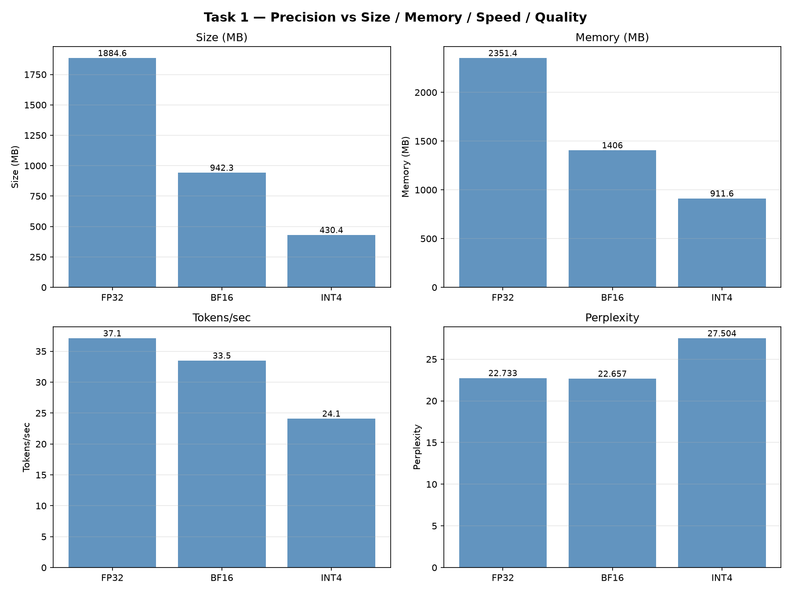

| Precision | Size (MB) | Memory (MB) | Tokens/sec | Perplexity |
|-----------|-----------|-------------|------------|------------|
| FP32      | 1884.6    | 2351.4      | 52.7       | 22.733     |
| BF16      | 942.3     | 1406.0      | **58.9**   | 22.664     |
| INT8      | 601.0     | 1062.0      | 10.4       | **22.936** |
| INT4      | 430.4     | 911.6       | 37.7       | 27.502     |

**Σχόλιο:**
- **Σωστή σχέση ταχύτητας** (tensor cores): **BF16 58.9 > FP32 52.7** tok/s όπου η
  χαμηλότερη ακρίβεια είναι ταχύτερη (το αντίθετο απ' ό,τι στη 1660, §2).
- **INT8 = πρωταθλητής ποιότητας:** PPL **22.936** (~lossless, +1.2% vs BF16) στα
  μισά bytes της FP32, αλλά **αργό (10.4 tok/s)** καθώς το bitsandbytes `LLM.int8()`
  κάνει mixed-precision outlier decomposition (για μνήμη, όχι ταχύτητα).
- **INT4 = μικρότερο/γρήγορο, αλλά lossy** (27.502, +21%). Καθαρό trade-off:
  *BF16 για ταχύτητα, INT8 για ποιότητα+μνήμη, INT4 για ελάχιστο μέγεθος.*
- Σύμφωνα και με την θεωρία του lab το σφάλμα rounding του INT4 αντιστοιχεί στο quantization error
  των toy πειραμάτων γεγονός το οποίο το GPTQ (§10) το μειώνει με Hessian compensation.

---

## 9. Extra: CPU benchmark (επικύρωση Σεναρίου 1) _(αποτελέσματα)_

Τα Tasks 1–3 έτρεξαν σε GPU, και το bitsandbytes είναι GPU-only. Επομένως το Σενάριο 1
του report (edge/CPU) στηριζόταν σε GPU μετρήσεις + υπόθεση. Το `cpu_benchmark.py`
τρέχει το μοντέλο **εξ ολοκλήρου σε CPU** (GTX-1660 box, GPU κρυμμένο) με HQQ
(calibration-free, CPU-capable). WikiText-2, 50 docs· `results/cpu_benchmark.png`.

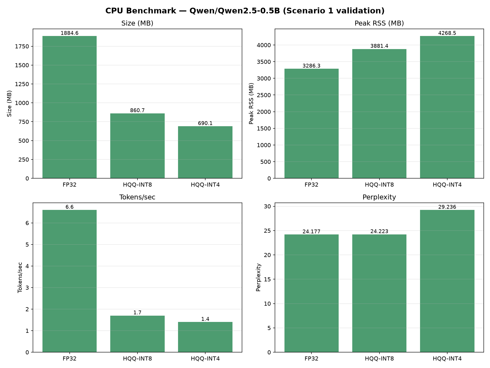

```bash
CUDA_VISIBLE_DEVICES="" python cpu_benchmark.py --n-docs 50 --new-tokens 64
```

| Config (CPU) | Size (MB) | Peak RSS (MB) | Tokens/sec | Perplexity |
|--------------|-----------|---------------|------------|------------|
| FP32 | 1884.6 | 3286 | **6.6** | 24.177 |
| HQQ-INT8 | 860.7 | 3881 | 1.7 | 24.223 |
| HQQ-INT4 | 690.1 | 4268 | 1.4 | 29.236 |

**Συμπέρασμα, η naive υπόθεση «INT4 = καλύτερο για edge» διορθώνεται:**
- **Μνήμη/δίσκος:** το HQQ-INT4 είναι **2.7× μικρότερο** (690 vs 1884 MB) → ο
  περιορισμός «≤4 GB για το μοντέλο» ικανοποιείται.
- **Latency (το κρίσιμο):** το HQQ-INT4 είναι **~4.7× πιο αργό** από το FP32
  (1.4 vs 6.6 tok/s), το HQQ κάνει dequant on-the-fly χωρίς optimized CPU kernel, και
  το peak RSS *ανεβαίνει* στο inference. Για <2 s χρειάζεται **GGUF/llama.cpp**, όχι το
  PyTorch path. Peak RSS ολόκληρης της διεργασίας (όχι μόνο μοντέλου).
- **Ποιότητα:** INT8 ≈ lossless (+0.2 %), INT4 +20.9 % το οποίο φαίνεται να ακολουθεί ίδιο μοτίβο με τις GPU μετρήσεις.

---

## 10. Task 2: GPTQ vs Naive INT4 _(αποτελέσματα)_

_RTX 4090 (final), GPTQ με Marlin kernel (`GPTQ_BACKEND=auto`)._

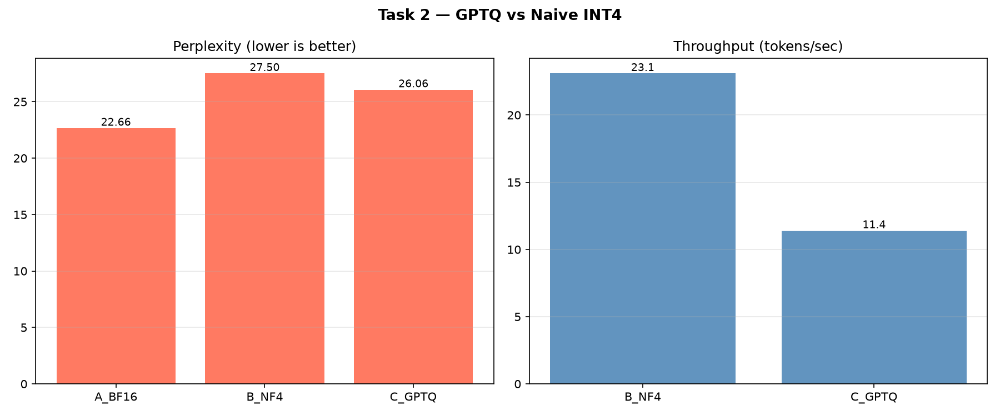

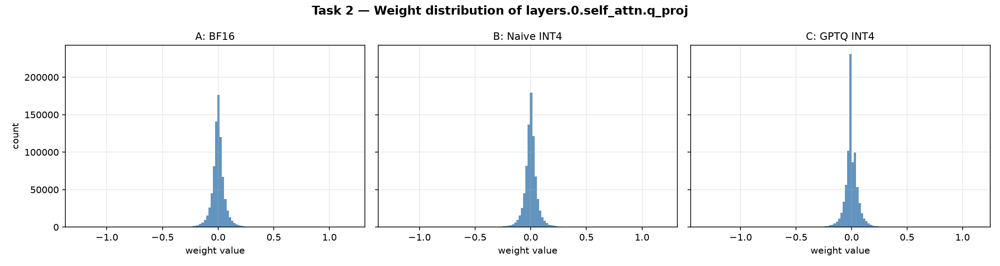

| Config | Method | Perplexity | Tokens/sec |
|--------|--------|------------|------------|
| A | BF16 baseline | 22.664 | — |
| B | Naive INT4 (NF4) | 27.502 | 35.6 |
| C | GPTQ INT4 | **26.215** | **46.9** |

- **GPTQ advantage έναντι naive INT4:** **1.286** PPL absolute, **4.7 %** reduction.
- **GPTQ νικάει το NF4 και στα δύο:** χαμηλότερο PPL (26.215 < 27.502) **και**
  ταχύτερο (46.9 > 35.6 tok/s) χάρη στο Marlin kernel. (Στη 1660 το GPTQ ήταν
  το πιο αργό, 11.4 tok/s με Torch fallback — βλ. §2.)
- **GPTQ calibration time:** ~2.6 λεπτά (128 samples, WikiText-2 **train** split).
- Το ιστόγραμμα δείχνει και τα τρία panels (A/B/C): το `_get_attn_weights` κάνει
  **dequantize** τα NF4 (`bitsandbytes.dequantize_4bit`) και τα GPTQ βάρη
  (`gptqmodel.dequantize_weight`), ώστε και τα τρία να είναι σε κοινή κλίμακα
  πραγματικών τιμών βαρών, αλλιώς τα B/C θα έδειχναν packed integer codes.

---

## 11. Task 3: Calibration Data Sensitivity _(αποτελέσματα)_

_Eval corpora: WikiText-2 test (English) & MBPP test (Python). Calibration:
C1 `wikimedia/wikipedia`, C2 `mbpp` train, C3 `ML-ArXiv-Papers` (βλ. §7)._

_RTX 4090 (final)._

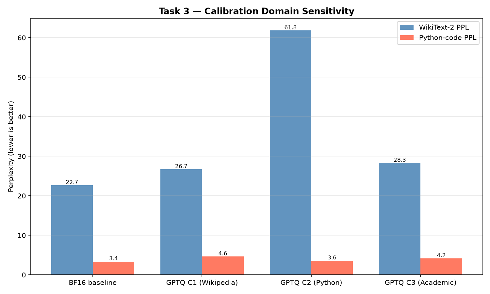

| Config | Calibration domain | WikiText-2 PPL | Python code PPL |
|--------|--------------------|--------------|---------------|
| BF16 baseline | — | 22.664 | 3.378 |
| GPTQ C1 | Wikipedia | **26.691** | 4.634 |
| GPTQ C2 | Python | 61.816 | **3.573** |
| GPTQ C3 | Academic | 28.296 | 4.166 |

**Συμπέρασμα το domain match έχει σημασία, και μάλιστα δραματικά:**
- Η **διαγώνιος νικάει**: C1 (Wikipedia) δίνει το χαμηλότερο WikiText PPL,
  C2 (Python) δίνει το χαμηλότερο Python PPL. Κάθε calibration domain παράγει
  το καλύτερο μοντέλο **στο δικό του domain**.
- **Cross-domain penalty:** το C2 (code-calibrated) εκτοξεύεται σε **61.82** PPL
  στα Αγγλικά, **2.7×** χειρότερα από το BF16 (22.66). Η calibration μόνο σε
  κώδικα καταστρέφει το γλωσσικό μοντέλο για prose.
- _Οι τιμές Python PPL (3.4–4.7) είναι χαμηλές γιατί τα MBPP solutions είναι
  σύντομα/προβλέψιμα· σύγκριση μόνο **εντός** στήλης, όχι μεταξύ στηλών._

### Ανάλυση (Task 3)

**Έχει σημασία το domain του calibration; Ναι και μάλιστα καθοριστικά.** Και τα
τρία GPTQ variants έχουν *πανομοιότυπους* hyperparameters (4-bit, group_size=128,
128 samples) και *ίδιο* μοντέλο· η **μόνη** μεταβλητή είναι το domain των 128
calibration δειγμάτων. Παρ' όλα αυτά, η ποιότητα στο κάθε eval domain αλλάζει
δραματικά. **Ποιο config κερδίζει πού:** το **C1 (Wikipedia)** δίνει το χαμηλότερο
WikiText-2 PPL (**26.691**), και το **C2 (Python)** δίνει το χαμηλότερο Python PPL
(**3.573**). Δηλαδή η βέλτιστη διαγώνιος είναι «calibration domain = evaluation
domain»: κάθε μοντέλο αποδίδει καλύτερα ακριβώς στο domain πάνω στο οποίο
βαθμονομήθηκε. Το **C3 (Academic)** είναι ένα ενδιάμεσο και μάλιστα ποτέ το καλύτερο σε κανένα
domain, αλλά ποτέ και καταστροφικό, δηλαδή ένας «ασφαλής» αλλά μη βέλτιστος συμβιβασμός.

**Γιατί συμβαίνει αυτό;** Το GPTQ εκτιμά το Hessian `H = 2XXᵀ`
από τα *activations* που παράγουν τα calibration inputs. Το `X` καθορίζει ποια
attention patterns και ποια outlier channels θεωρεί «σημαντικά» το error-compensation
βήμα. Αν το calibration ενεργοποιεί άλλη κατανομή activations από το deployment,
τότε η αντιστάθμιση σφάλματος διορθώνει **λάθος σήμα**: προστατεύει βάρη που δεν
μετράνε στο πραγματικό workload και θυσιάζει βάρη που μετράνε. Αυτό είναι το
πραγματικό-μοντέλο ανάλογο του **Extension 3** του lab (η μελέτη σειράς
κβαντισμού με βάση τη διαγώνιο του `H_inv`): η επιλογή του τι θεωρείται «ευαίσθητο»
εξαρτάται απευθείας από τα δεδομένα που τροφοδοτούν το Hessian. Το ακραίο παράδειγμα
είναι το **C2 στα Αγγλικά: 61.8 PPL, 2.7× χειρότερα από το BF16** η αποκλειστική
βαθμονόμηση σε κώδικα κατέστρεψε το γλωσσικό μοντέλο για prose.

**Πότε αξίζει το domain-matched calibration σε πραγματικό deployment;** Αξίζει
**μόνο όταν το deployment domain είναι στενό, γνωστό εκ των προτέρων και σταθερό** —
π.χ. ένας αποκλειστικός code assistant που θα δει σχεδόν αποκλειστικά Python: εκεί το
in-domain calibration δίνει μετρήσιμο κέρδος (C2: 3.573 vs C1: 4.634 στο Python) με
ελάχιστο ρίσκο, γιατί η κίνηση δεν θα ξεφύγει από το domain. Αντίθετα, για **general-purpose
serving** με ευρύ/απρόβλεπτο μείγμα requests, το domain-matched calibration είναι
**ενεργά επικίνδυνο**: η κατάρρευση του C2 δείχνει ότι ένα στενά βαθμονομημένο μοντέλο
μπορεί να γίνει άχρηστο εκτός domain. Εκεί η σωστή επιλογή είναι γενικό/μεικτό
calibration (τύπου C1 ή C3), που θυσιάζει λίγη peak ποιότητα για robustness. Ο κανόνας
που προκύπτει και τροφοδοτεί το Task 4: *αξίζει να επενδύσουμε σε domain-matched calibration μόνο
όταν μπορείς να εγγυηθείς ότι το deployment traffic ταιριάζει με το calibration domain·
αλλιώς η ασφαλής, γενική βαθμονόμηση κερδίζει.*

---

## 12. Bonus A: 2-bit (HQQ) & quality floor _(αποτελέσματα)_

Πλήρης precision curve FP32 → BF16 → INT8 → INT4 → INT2 (`results/bonus_2bit_precision_curve.png`).

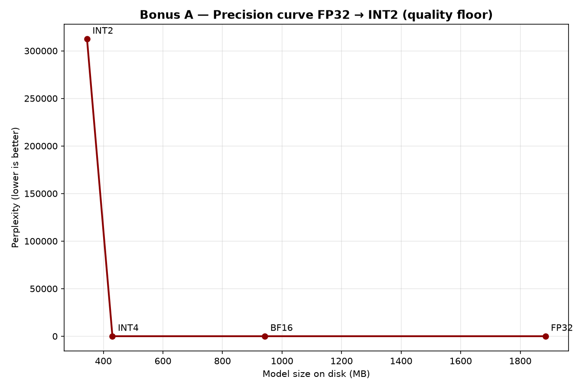

_RTX 4090 (final). Σημεία FP32/BF16/INT8/INT4 από §8· INT2 μετρημένο εδώ (πλήρες
σετ metrics, ίδιο eval corpus)._

| Precision | Size (MB) | Memory (MB) | Tokens/sec | Perplexity |
|-----------|-----------|-------------|------------|------------|
| FP32 | 1884.6 | 2351.4 | 52.7 | 22.733 |
| BF16 | 942.3 | 1406.0 | 58.9 | 22.664 |
| INT8 | 601.0 | 1062.0 | 10.4 | 22.936 |
| INT4 (NF4) | 430.4 | 911.6 | 37.7 | 27.502 |
| **INT2 (HQQ)** | **345.1** | **827.3** | **16.1** | **312314** |

**Συμπέρασμα: Tο quality floor είναι στα 2-bit.** Tο INT2 **καταρρέει** (PPL
312k έναντι 27.5 στα INT4). Το HQQ εδώ είναι calibration-free RTN, χωρίς
Hessian error-compensation (όπως το GPTQ) ή QAT, τα 4 επίπεδα ανά βάρος δεν
αρκούν για ένα μικρό μοντέλο 0.5B. _Σημείωση ταχύτητας:_ το INT2 τρέχει και
**πιο αργά** από το INT4 (16.1 vs 37.7 t/s): το HQQ 2-bit δεν έχει fused kernel,
οπότε το dequant γίνεται on-the-fly, άρα η επιθετική συμπίεση δεν φέρνει ούτε
ταχύτητα ούτε ποιότητα εδώ. _Σημείωση μεγέθους:_ το INT2 δεν είναι 4×
μικρότερο από το INT4 γιατί ο tied embedding/`lm_head` πίνακας (151936×896 ≈
27 % του μοντέλου) μένει FP16 (~272 MB), το HQQ κβαντίζει μόνο `Linear` layers.

**Σύνδεση με τη θεωρία (Hadamard / QuIP#).** Το lab (Part 2) έδειξε ότι ο
μετασχηματισμός Hadamard (`W' = WH`, με `H Hᵀ = I`) + τα random sign diagonals του
QuIP# (`D = diag(±1)`) κάνουν τα βάρη πιο ομοιόμορφα/**incoherent** (μικρότερο max |w|),
ώστε το 2-bit rounding να χάνει λιγότερη πληροφορία. Το HQQ είναι calibration-free RTN
**χωρίς** τέτοιον incoherence μετασχηματισμό οπότε η κατάρρευση που μετράμε στα 2-bit
είναι **συνεπής με τη θεωρητική πρόβλεψη**. Πρακτικά αναδεικνύει ακριβώς το κενό που το QuIP#
γεμίζει. Με Hadamard incoherence preprocessing, το 2-bit θα ήταν σαφώς πιο ανθεκτικό.

---

## 13. Extra: GPTQ hyperparameter ablation _(αποτελέσματα)_

**Γιατί το κάναμε:** σε όλα τα Tasks 2–3 χρησιμοποιούμε τις default τιμές GPTQ
(`group_size=128`, `n_calib=128`), θέλαμε να δούμε **πόσο ευαίσθητη είναι πραγματικά
η ποιότητα του GPTQ σε αυτούς τους δύο knobs** και αν τα defaults είναι όντως βέλτιστα
ή ένας σκόπιμος συμβιβασμός ποιότητας/μεγέθους/χρόνου. Συγκεκριμένα ελέγχουμε δύο
υποθέσεις από το lab (Part 3): ότι **μικρότερο `group_size`** δίνει καλύτερη ποιότητα
(πιο τοπικά scales/zeros) και ότι το **Hessian estimate σταθεροποιείται** πέρα από ένα
πλήθος calibration samples αλλάζοντας έναν knob τη φορά, με όλα τα άλλα σταθερά.

WikiText-2 PPL μεταβάλλοντας έναν knob του GPTQ κάθε φορά
(`results/ablation_gptq.png`, RTX 4090):

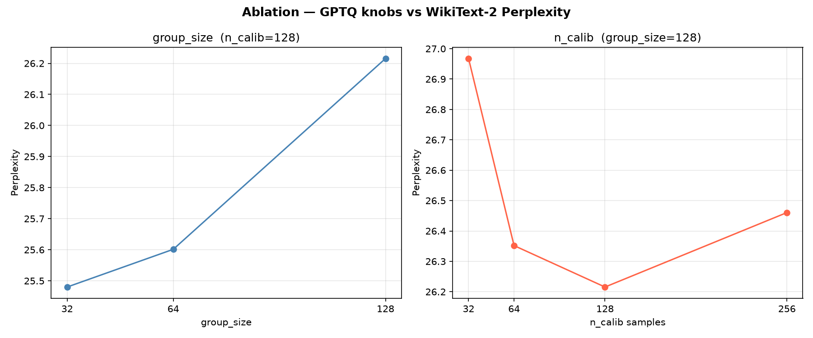

**Σάρωση A: `group_size`** (`n_calib=128` σταθερό):

| group_size | PPL |
|---|---|
| 32 | **25.480** |
| 64 | 25.601 |
| 128 (default) | 26.215 |

**Σάρωση B: `n_calib`** (`group_size=128` σταθερό):

| n_calib | PPL |
|---|---|
| 32 | 26.968 |
| 64 | 26.352 |
| 128 (default) | **26.215** |
| 256 | 26.461 |

_(Το κοινό σημείο `gs=128 / n_calib=128 = 26.215` ταυτίζεται με το GPTQ INT4 του §10.)_

**Συμπέρασμα:**
- **`group_size`: όσο μικρότερο, τόσο καλύτερη ποιότητα(μονότονα)** (32→25.48 vs
  128→26.22, δηλαδή **−2.8 %** PPL). Το κόστος είναι λίγο μεγαλύτερο αρχείο (περισσότερα
  scales/zeros ανά πίνακα). **Για μέγιστη ποιότητα → `gs=32` (ή `gs=64` για ισορροπία)·**
  το default 128 θυσιάζει σκόπιμα λίγη ποιότητα για μικρότερο footprint.
- **`n_calib`: βελτιώνει μέχρι ~128 και μετά κορεσμός**, το 256 είναι *ελαφρώς*
  χειρότερο (26.46 vs 26.22, +0.9 %), σημάδι ότι πέρα από ~128 samples το Hessian
  estimate δεν κερδίζει άλλο και μπαίνει θόρυβος. Άρα **`n_calib=128` είναι η χρυσή τομή** (περισσότερα samples = χαμένος χρόνος calibration χωρίς όφελος).

---

## 14. Extra: Scaling extension στο Qwen2.5-1.5B _(αποτελέσματα)_

Επανάληψη Task 1 + Task 2 σε **3× μεγαλύτερο** μοντέλο (RTX 4090· plots με
suffix `_Qwen2_5_1_5B`).

**Task 1 (1.5B):**

| Precision | Size (MB) | Memory (MB) | Tokens/sec | Perplexity |
|-----------|-----------|-------------|------------|------------|
| FP32 | 5888.8 | 6372.3 | 40.2 | 15.689 |
| BF16 | 2944.4 | 3412.4 | 41.6 | 15.679 |
| INT8 | 1694.9 | 2167.9 | 9.1 | 15.821 |
| INT4 | 1070.2 | 1624.8 | 28.9 | 17.827 |

**Task 2 (1.5B):** NF4 17.827 · GPTQ **16.802** · advantage **1.025 PPL (5.7 %)**.

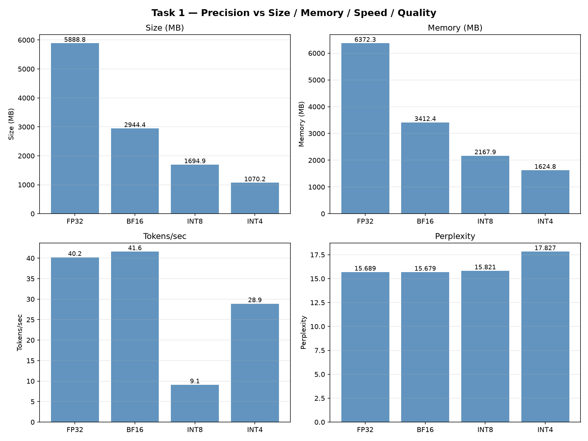

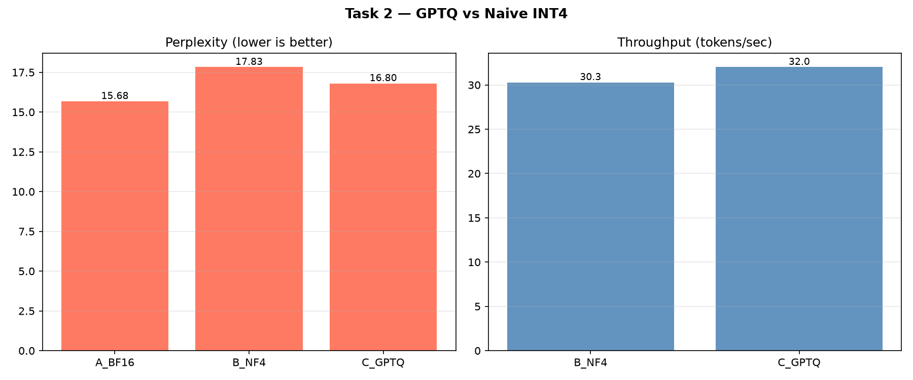

**Συμπέρασμα: το quantization κλιμακώνει ευνοϊκά με το μέγεθος:**
- **Η ποινή του INT4 μικραίνει:** +21 % στο 0.5B → **+13.7 %** στο 1.5B
  (17.827 vs BF16 15.679). Μεγαλύτερο μοντέλο = πιο ανθεκτικό στο 4-bit.
- **Το πλεονέκτημα του GPTQ μεγαλώνει:** 4.7 % (0.5B) → **5.7 %** (1.5B).
- **Το INT8 μένει ~lossless** (+0.9 %) και πλέον **εντός** του budget 5 % (Σενάριο 2).

---

## 15. Bonus B — Cross-architecture portability (`meta-llama/Llama-3.2-1B-Instruct`) _(αποτελέσματα)_

Δυστυχώς παρά την αναζήτησή μας δεν βρέθηκε συμφοιτητής που να ήθελε συνεργασία, οπότε κρατήσαμε την ουσία του Bonus B
(«εφάρμοσε το toolkit σε ξένο μοντέλο») τρέχοντας **ολόκληρο το pipeline σε
διαφορετική αρχιτεκτονική** Llama αντί Qwen (RTX 4090· plots με suffix
`_Llama_3_2_1B_Instruct`). Πλήρης ανάλυση: **[`collaboration_report.md`](collaboration_report.md)**.

> Επιλέξαμε σκόπιμα την **Instruct** (production) παραλλαγή, όχι τη base: αφού δεν
> υπήρχε διαθέσιμος συμφοιτητής, προσπάθησα να **προσομοιώσω** ένα ρεαλιστικό «μοντέλο
> συμφοιτητή», δηλαδή ένα fine-tuned / deployed μοντέλο, όχι ένα raw base checkpoint.
>

**Task 1 (Llama-1B):**

| Precision | Size (MB) | Memory (MB) | Tokens/sec | Perplexity |
|-----------|-----------|-------------|------------|------------|
| FP32 | 4714.3 | 5134.4 | 45.3 | 25.548 |
| BF16 | 2357.1 | 2758.0 | 50.3 | 25.573 |
| INT8 | 1429.1 | 1831.5 | 14.1 | 25.959 |
| INT4 | 965.1 | 1424.1 | 36.2 | 27.900 |

**Task 2 (Llama-1B):** NF4 27.900 @ 36.1 t/s · GPTQ 28.830 @ **42.5 t/s** (Marlin).
**Task 3:** διαγώνιος OK (C1→WikiText 28.496, C2→Python 5.913). **Bonus A:** 2-bit κατάρρευση (PPL 274.7k).

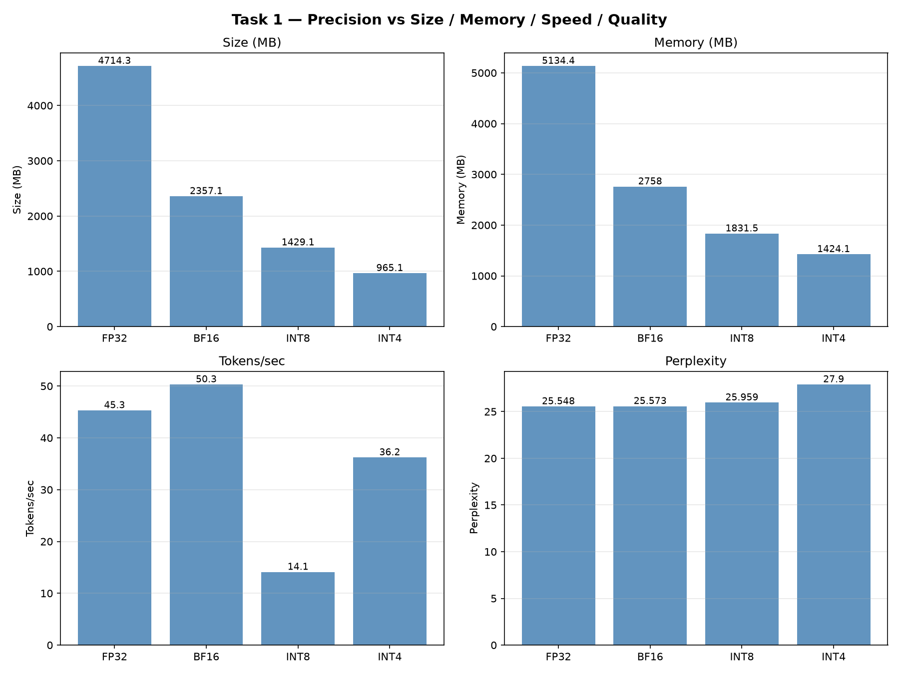

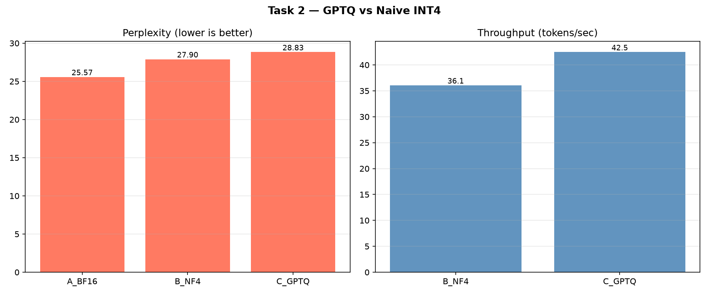

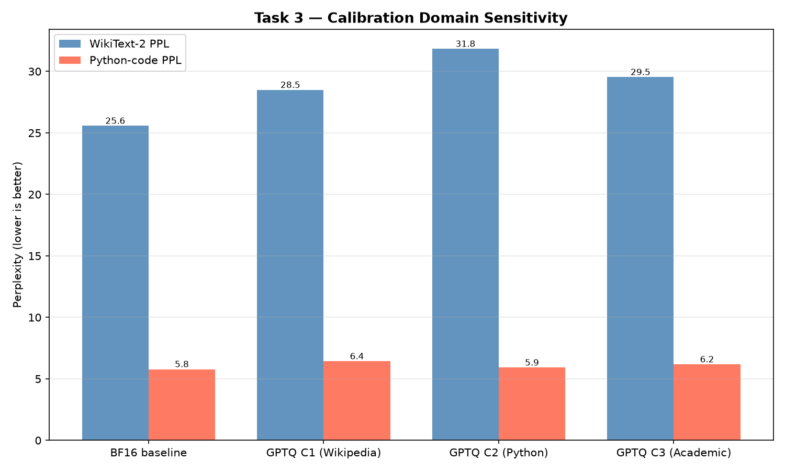


**Τι μεταφέρεται:** BF16 sweet spot, INT8 ακριβές-αλλά-αργό, 2-bit κατάρρευση, και η
διαγώνιος του Task 3. Επομένως, όλα αναπαράγονται σε ξένη αρχιτεκτονική. **Νέο εύρημα:** το
GPTQ είναι εδώ −3.3 % σε ποιότητα αλλά +18 % σε ταχύτητα έναντι NF4, άρα το αξιόπιστο
όφελός του είναι το throughput (Marlin), ενώ το όφελος ποιότητας εξαρτάται από το μοντέλο.

---